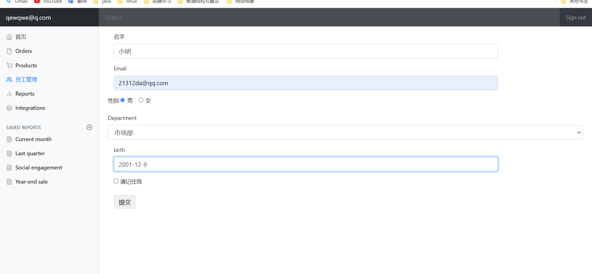
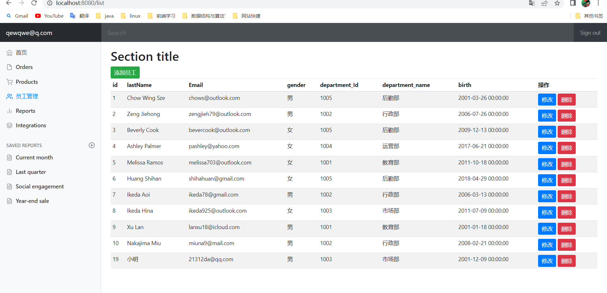
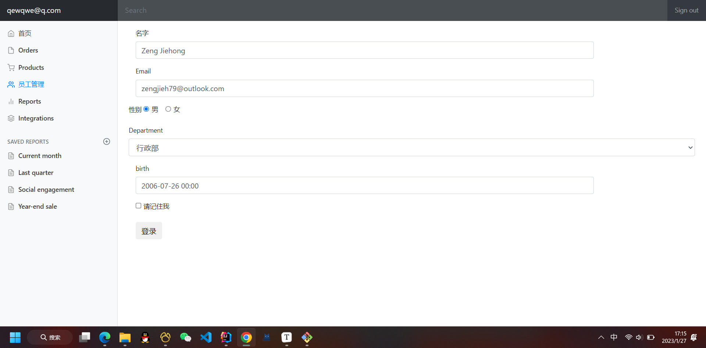
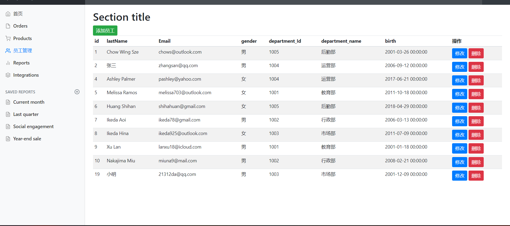
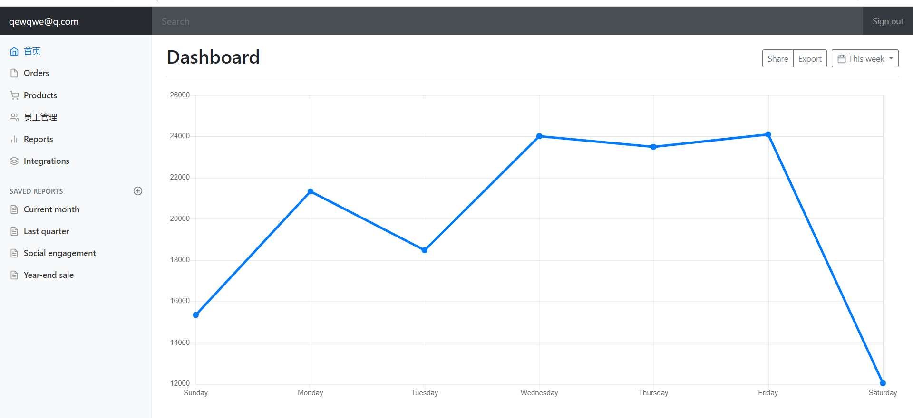
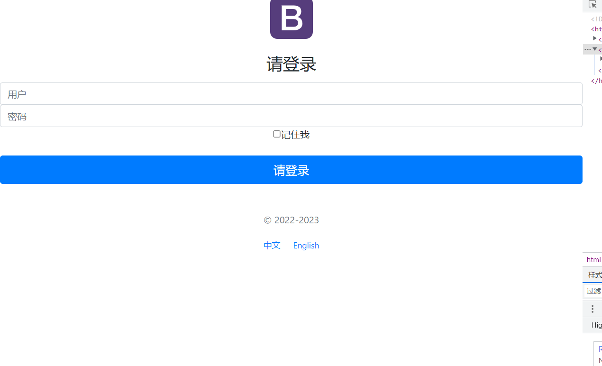

# Employee-Management-System(员工管理系统)

## 技术选型

后端：

- springBoot
- mybatis
- mysql

前端：

- 渲染：Thymeleaf
- html + css + js

后台模块：

- X-admin

## 功能展示

### 员工列表页

### 添加页

### 添加成功

### 修改页

### 修改成功

### 首页

### 登录页

